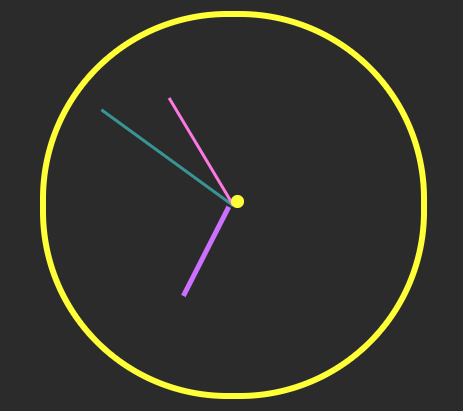

# javascript-analog-clock
Analog Clock Written in JavaScript

# Image Example

# License
Please see [Apache 2.0 License](./LICENSE) for details.

# References
Kubów, A. (2022, August 10). <i>Build an Analog Clock in JavaScript!</i> YouTube. Retrieved August 
    16, 2022, from https://www.youtube.com/watch?v=hbe2hn4W3z0&ab_channel=CodewithAniaKub%C3%B3w
